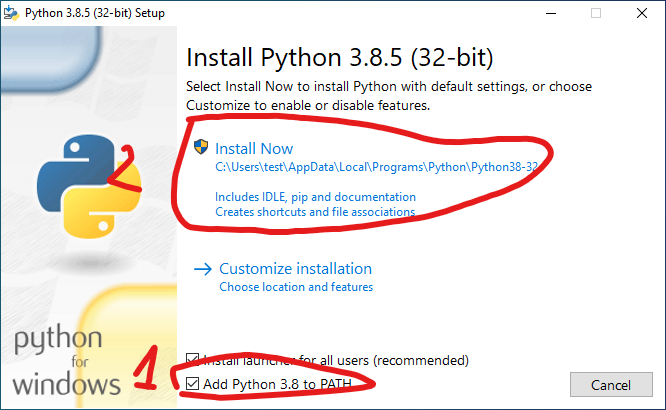

Installation
************

.. note::
    | If you already have python installed in you system please verify that the script folder is in your PATH or you wont be able to call ``pyscandl``.
    | If you encounter a similar line during the installation it mean that you don't have the script folder in your PATH, add it to it
    .. image:: ../img/path_prompt.png
            :alt: prompt if not in path

Installing python (if not already on your system)
=================================================

Windows
-------

1. Download python from `their website <https://www.python.org/downloads/>`_
2. Launch the installer
3. don't forget to add Python to the PATH

Linux
-----

Install it from your package manager of choice

Mac
---

I don't have a mac so i can't tell you the best method but like for windows the python installer from `their website <https://www.python.org/downloads/>`_ should work, otherwise you can use ``brew``

From PyPI (recommended)
=======================

This option is recommended for most users, you will have the most stable experience.

1. install the python program:

.. code-block:: none

     pip install pyscandl

2. enjoy

Updating
--------

When a new release is made you can upgrade your installation using:

.. code-block:: none

    pip install pyscandl -U

Using setup.py
==============

This option is recommended for development and people wanting to use the bleeding edge before the releases. Stability is not guaranteed.

1. install the python program:

.. code-block:: bash

    git clone https://github.com/Ara0n/pyscandl.git
    cd pyscandl
    python3 setup.py install

2. enjoy

Legacy (Not recommended)
========================

.. warning:: This was the old method used before ``setup.py`` and PyPI, i don't recommend to anyone to use this method anymore !

From source
-----------

1. check if you have ``python3.7`` or above installed *(modern installations normally have it installed by default now)*
2. check if you have the corresponding ``pip`` installed
3. clone the repository

.. code-block:: none

    git clone https://github.com/Ara0n/pyscandl.git

4. install the dependencies of ``pyscandl``

.. code-block:: bash

    cd pyscandl
    python3 -m pip install -r requirements.txt

.. note::
    the name of the python used might differ depending on your OS and or pythons installed, just be sure to use one with ``pip`` and that is ``python3.7`` or higher

The program is now ready to be used, don't forget from time to time to check if new code and features were added and if yes do a ``git pull``

From release
------------

1. check if you have ``python3.7`` or above installed *(modern installations normally have it installed by default now)*
2. check if you have the corresponding ``pip`` installed
3. download the `latest release <https://github.com/Ara0n/pyscandl/release/latest>`_ here
4. install the dependencies of ``pyscandl``

.. code-block:: bash

    cd pyscandl
    python3 -m pip install -r requirements.txt

.. note::
    the name of the python used might differ depending on your OS and or pythons installed, just be sure to use one with ``pip`` and that is ``python3.7`` or higher

The program is now ready to be used, don't forget from time to time to check if a new release is out `here <https://github.com/Ara0n/pyscandl/release/latest>`_ and if yes download it.

Requirements
============

The current python requirements are:

.. literalinclude:: ../../../requirements.txt
